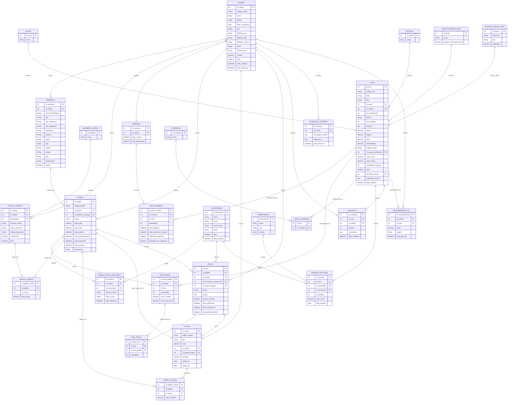

# MODELO DE DADOS — NEXO (E-COMMERCE DE LIVROS)

Este documento apresenta o modelo de dados da plataforma **Nexo**, um e-commerce
especializado em livros e produtos culturais, com recomendação personalizada via
Inteligência Artificial. O modelo foi elaborado com base no documento
`REGRAS_DE_NEGOCIO.md` (Requisitos Funcionais - RF, Requisitos Não Funcionais - RNF
e Regras de Negócio - RN) e cobre os módulos de:

- Cadastro de Clientes (RF002x / RN002x)
- Cadastro de Livros (RF001x / RN001x)
- Gestão de Vendas Eletrônicas: carrinho, pedido, pagamento combinado, cupons (RF003x / RN003x)
- Controle de Estoque (RF005x / RN005x)
- Trocas (RF004x)
- Análise Gerencial (RF005x-8 / RN007x)
- Avaliações de produto (estrelas + comentário) — página de detalhe do livro
- Recomendação personalizada por IA e Chatbot (RNF0044)
- Auditoria de escrita (RNF0012)

---

## 1. Diagrama Entidade-Relacionamento (Mermaid)

---

## 2. Dicionário de Dados

### 2.1 CLIENTE (RF002x / RN002x / RN0026 / RNF0031-35)
| Campo | Tipo | Descrição |
|---|---|---|
| id_cliente | PK | Identificador interno |
| codigo_cliente | string único | Código único de negócio (RNF0035) |
| nome | string | Nome completo (obrigatório - RN0026) |
| genero | string | Obrigatório - RN0026 |
| data_nascimento | date | Obrigatório - RN0026 |
| cpf | string único | Obrigatório - RN0026 |
| telefone_tipo/ddd/numero | string | Telefone composto (RN0026) |
| email | string único | Obrigatório - RN0026 |
| senha_hash | string | Senha criptografada (RNF0033), forte (RNF0031) |
| ranking | decimal | Ranking numérico do cliente (RN0027) |
| ativo | boolean | Suporta inativação (RF0023) |
| data_cadastro / data_inativacao | datetime | Auditoria |

### 2.2 ENDERECO (RN0021-23 / RF0026 / RNF0034)
Tipo `ENTREGA`, `COBRANCA` ou `AMBOS`. Todo cliente deve ter ao menos um endereço de
cada tipo (RN0021/RN0022). Campos obrigatórios: tipo de residência, tipo de
logradouro, logradouro, número, bairro, CEP, cidade, estado, país (RN0023);
`observacoes` é opcional. `nome_identificador` é a frase curta exigida em RF0026.

### 2.3 BANDEIRA_CARTAO / CARTAO_CREDITO (RN0024-25 / RF0027)
Domínio de bandeiras cadastradas no sistema. Cada cliente pode ter vários cartões,
um marcado como `preferencial` (RF0027). Campos obrigatórios do cartão: número,
nome impresso, bandeira e código de segurança (RN0024).

### 2.4 FUNCIONARIO
Representa usuários administradores/operadores (perfis: `ADMIN`, `GERENTE_VENDAS`,
`OPERADOR_ESTOQUE`). O perfil `GERENTE_VENDAS` é exigido para autorizar alterações
de preço fora da margem de lucro (RN0014).

### 2.5 Catálogo — AUTOR, EDITORA, CATEGORIA, LIVRO_CATEGORIA, GRUPO_PRECIFICACAO, MOTIVO_STATUS_LIVRO, LIVRO (RF001x / RN001x / RNF0021)
- `LIVRO_CATEGORIA` implementa o relacionamento N:N de RN0012 (um livro pode ter
  mais de uma categoria).
- `GRUPO_PRECIFICACAO` define a margem de lucro usada para calcular `valor_venda`
  a partir de `valor_custo` (RN0013/RF0052); alterações abaixo da margem exigem
  autorização de gerente (RN0014).
- `MOTIVO_STATUS_LIVRO` guarda os motivos de ativação/inativação manual e a
  categoria fixa `FORA DE MERCADO` usada na inativação automática (RN0015-17 /
  RF0013).
- Campos obrigatórios do livro: autor, categoria, ano, título, editora, edição,
  ISBN, número de páginas, sinopse, dimensões, grupo de precificação e código de
  barras (RN0011). `codigo_livro` é o código único de negócio (RNF0021).
  `quantidade_estoque` é um saldo derivado, atualizado pelas entradas de estoque e
  pela baixa em vendas aprovadas (RF0053).

### 2.6 FORNECEDOR / ENTRADA_ESTOQUE (RF0051 / RN0050-51 / RN0061-62 / RNF0064)
Toda entrada de estoque exige livro, quantidade (> 0 — RN0061), valor de custo
(RN0062), fornecedor e data de entrada (obrigatória — RNF0064). Quando há
diferentes custos, o cálculo de venda considera o maior custo (RN0051).

### 2.7 CARRINHO / ITEM_CARRINHO (RF0031-32 / RN0031-32 / RN0044-45 / RNF0042)
Um carrinho por cliente. Cada `ITEM_CARRINHO` guarda `data_bloqueio` e
`data_expiracao_bloqueio` para implementar o bloqueio temporário do item (RN0044),
com notificação 5 minutos antes de expirar (`notificado_expiracao`) e remoção
automática (`removido_por_expiracao`) exibida na listagem (RNF0042). A validação
de estoque na adição e na finalização é responsabilidade da camada de aplicação
(RN0031/RN0032), usando `LIVRO.quantidade_estoque`.

### 2.8 PEDIDO / ITEM_PEDIDO / PEDIDO_STATUS_HISTORICO (RF0033-40 / RN0038-40 / RNF0012)
`status` segue o fluxo: `EM_ABERTO` → `EM_PROCESSAMENTO` → `APROVADA`
(pagamento realizado) ou `REPROVADA` → `EM_TRANSITO` → `ENTREGUE` → (opcional)
`EM_TROCA` → `TROCADO`. `PEDIDO_STATUS_HISTORICO` registra cada transição
(usuário/funcionário responsável, data/hora) atendendo ao log de transação
exigido em RNF0012.

### 2.9 PEDIDO_CARTAO / CUPOM / PEDIDO_CUPOM (RF0036-38 / RN0033-37)
- `PEDIDO_CARTAO` permite pagar um pedido com **vários cartões**; cada linha deve
  ter `valor_pago >= 10.00`, exceto quando cupons cobrem o restante (RN0034/RN0035
  — validado na aplicação, pois é uma regra condicional).
- `CUPOM.tipo` é `PROMOCIONAL` ou `TROCA`. Apenas um cupom promocional por compra
  (RN0033), controlado na aplicação/trigger sobre `PEDIDO_CUPOM`.
- Quando o total de cupons usados excede o valor do pedido, gera-se um novo
  `CUPOM` do tipo `TROCA` com a diferença, referenciando `id_pedido_origem`
  (RN0036).

### 2.10 TROCA / ITEM_TROCA (RF0041-45 / RN0041-43 / RN0046)
Somente itens de pedidos `ENTREGUE` podem gerar solicitação de troca (RN0043).
`status`: `SOLICITADA` → `ACEITA`/`NEGADA` → `ITEM_ENVIADO` → `ITEM_RECEBIDO` →
`PROCESSADA`. Ao confirmar recebimento, `retorna_estoque` indica se os itens
voltam ao estoque (gera nova `ENTRADA_ESTOQUE`) e um `CUPOM` do tipo `TROCA` é
gerado para o cliente (RF0045). A autorização gera notificação ao cliente
(RN0046, tratado na camada de aplicação/serviço de notificações).

### 2.11 AVALIACAO (Página de Detalhe do Livro)
Comentário e nota de estrelas (1 a 5) que um cliente registra sobre um livro,
exibidos na página de detalhe do produto, e utilizados como insumo de feedback
para o motor de recomendação por IA (RNF0044-3).

### 2.12 INTERACAO_CHATBOT / RECOMENDACAO_IA (RNF0044 / Recomendação Personalizada)
`INTERACAO_CHATBOT` registra o histórico de conversas do cliente com o assistente
de IA. `RECOMENDACAO_IA` registra as sugestões geradas para cada cliente/livro,
com um `score` de relevância e a `origem` da recomendação
(`HISTORICO_COMPRA`, `PREFERENCIA`, `CHATBOT`, `FEEDBACK`), alimentando o
treinamento contínuo do modelo (RNF0044-3).

---

## 3. Domínios (ENUM) utilizados

| Domínio | Valores |
|---|---|
| `endereco.tipo` | ENTREGA, COBRANCA, AMBOS |
| `funcionario.perfil` | ADMIN, GERENTE_VENDAS, OPERADOR_ESTOQUE |
| `motivo_status_livro.tipo` | ATIVACAO, INATIVACAO |
| `pedido.status` | EM_ABERTO, EM_PROCESSAMENTO, APROVADA, REPROVADA, EM_TRANSITO, ENTREGUE, EM_TROCA, TROCA_AUTORIZADA, TROCADO, CANCELADO |
| `cupom.tipo` | PROMOCIONAL, TROCA |
| `troca.status` | SOLICITADA, ACEITA, NEGADA, ITEM_ENVIADO, ITEM_RECEBIDO, PROCESSADA |
| `recomendacao_ia.origem` | HISTORICO_COMPRA, PREFERENCIA, CHATBOT, FEEDBACK |

O DDL correspondente a este modelo está disponível em `bdd/schema.sql`, pronto
para execução em MySQL 8+.

